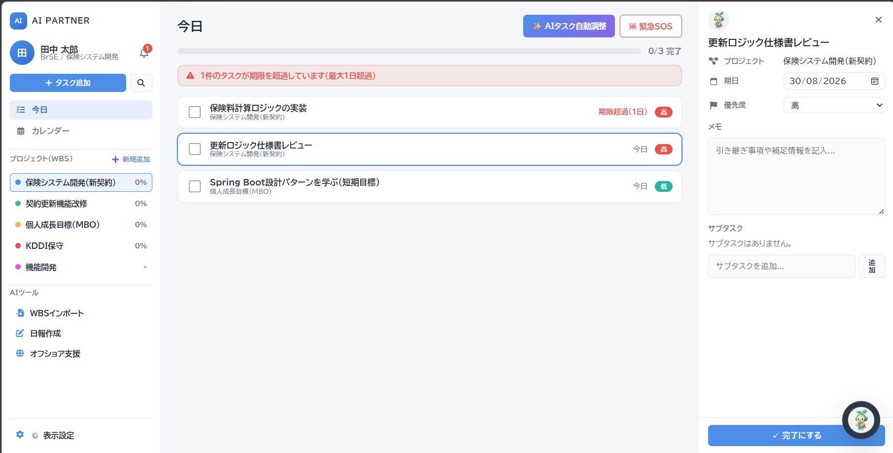
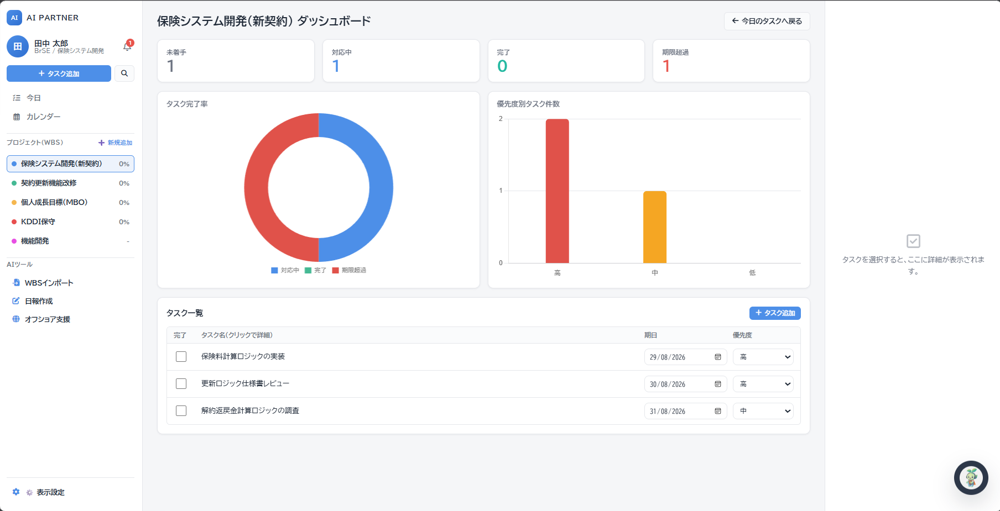
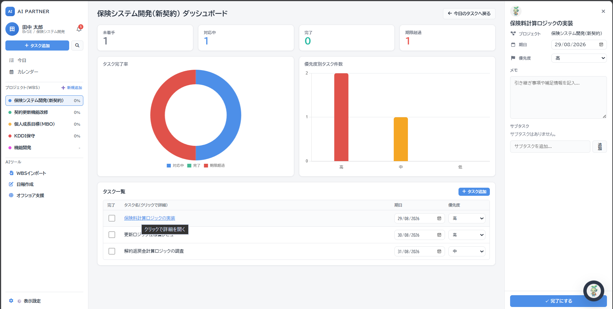
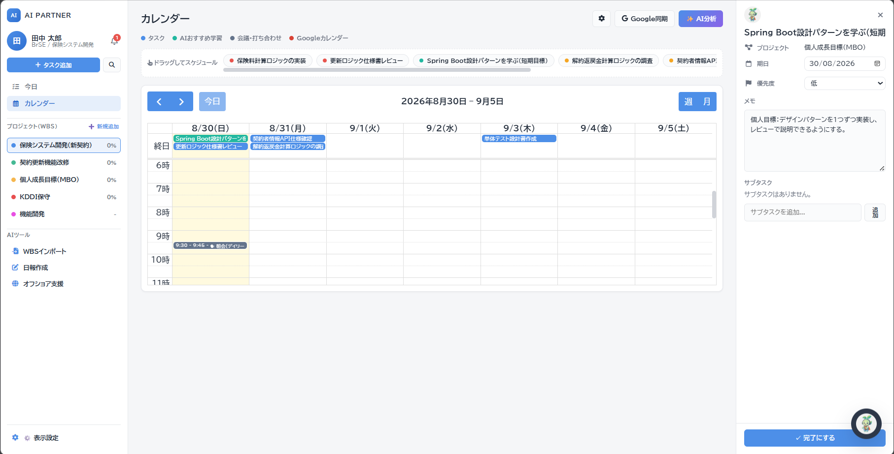
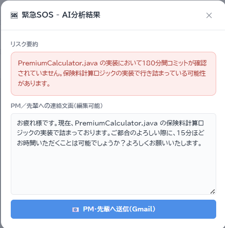
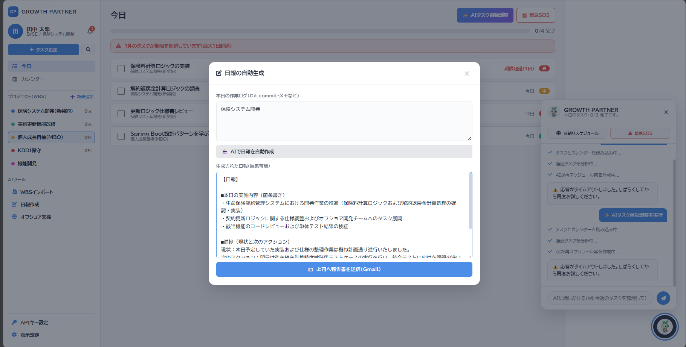
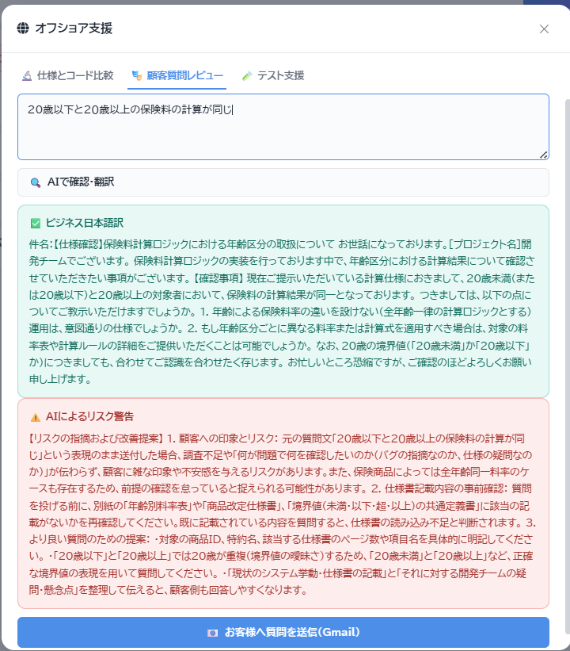
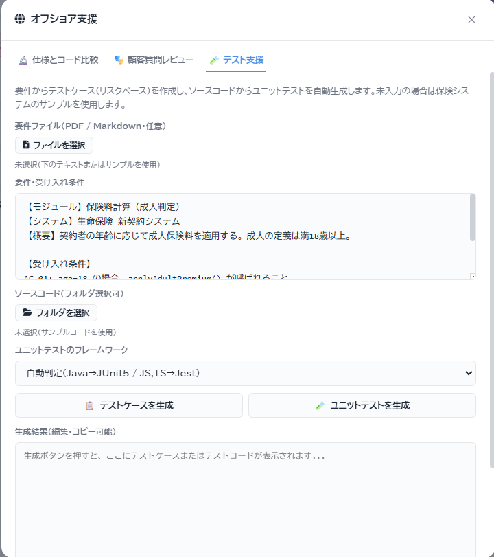
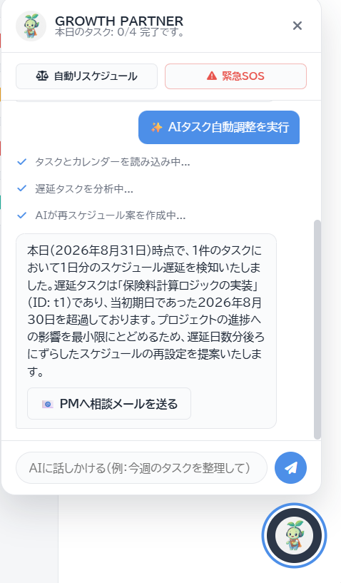
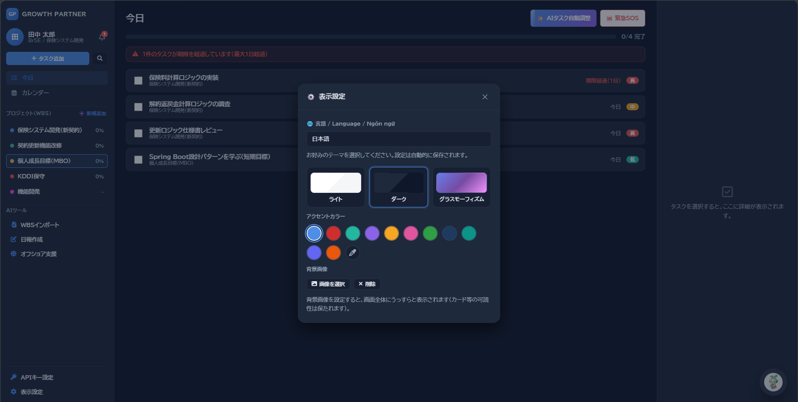

# GROWTH PARTNER

GROWTH PARTNERは、日本のSIerに勤務する **BrSE（ブリッジSE）および新人SE** を対象とした自律型AIアシスタントです。

日々のタスク、カレンダー、学習目標（MBO）を一つの画面で把握でき、AIが遅延の検知、日報の作成、オフショア開発における成果物のレビューを支援します。画面上の文言には、すべてビジネス日本語を使用しています。

> **本資料の位置づけ**
>
> 本READMEは、開発・営業・品質保証・マネジメントの関係者に、製品の価値と機能範囲を共有するための紹介資料です。
>
> 現時点では、社内ハッカソン向けの **動作するプロトタイプ** です。認証、権限管理、実プロジェクトデータの永続化など、本番運用に必要な機能は対象外としています。

---

## 1. 解決する課題

オフショア開発の現場では、BrSEが複数の役割を同時に担うため、次のような課題が生じます。

| 現場で生じやすい課題 | 対応が遅れた場合のリスク |
| --- | --- |
| タスクの期日と学習計画が重なる | 遅延の報告が遅れ、信頼を損なう |
| 日報や顧客への質問文の作成に時間を要する | 本来のブリッジ業務に集中できない |
| 仕様とコードの差異や、質問文の表現上の問題に気づきにくい | 手戻り、品質不良、顧客の印象悪化につながる |
| 実装で行き詰まった際に、相談のタイミングを逃す | 一人で問題を抱え込み、納期リスクが拡大する |

GROWTH PARTNERは、利用者が後から情報を入力する作業にとどまらず、画面上で課題への気づきを促し、対応に必要な文面の下書きまで用意する **伴走型の支援** として設計しています。

---

## 2. 対象利用者

| 対象 | 主な利用シーン |
| --- | --- |
| 新人エンジニア | 当日の対応事項、遅延状況、学習目標を一目で確認する |
| 現場のエンジニア | 顧客への質問文を日本語に整える、仕様とコードの差分を確認する、日報の下書きを作成する |
| PM・先輩社員 | 遅延に関する相談メール案や、SOS時の状況共有に活用する。送付は利用者本人が内容を確認したうえで行う |

デモデータは、保険料計算、契約更新、解約返戻金などを扱う **保険の契約管理システム** を想定した架空の案件です。実在する顧客名や実プロジェクトのソースコードは使用していません。

---

## 3. 製品コンセプト

- **カレンダーを中心とした業務管理**：予定とタスクを同じ時間軸で把握します。
- **操作を妨げないAI支援**：AIはメイン画面の操作を妨げず、必要な場面で動作します。処理結果はトースト通知やチャットで確認できます。
- **人による最終判断**：メール送信や顧客への連絡は、必ず本人が内容を確認してから行います。アプリによる支援は下書きの作成までとし、直接送信は行いません。
- **オフショア開発における品質の橋渡し**：仕様とコードの整合性確認、質問文の調整、テストケースの作成を、日本語のビジネス文脈に沿って支援します。

---

## 4. 画面構成（3カラム）

起動時は、次の構成で表示されます。

| 領域 | 役割 |
| --- | --- |
| 左：ナビゲーション | 「今日」「カレンダー」、プロジェクト一覧、AIツール、表示設定へのアクセス |
| 中央：作業エリア | 当日のタスク、プロジェクトダッシュボード、週次カレンダーの表示 |
| 右：タスク詳細 | 選択したタスクの期日、優先度、メモ、サブタスクの表示・編集 |

画面右下のマスコットを選択すると、AIチャットが開きます。チャットは右側のタスク詳細パネルとは独立しており、必要なときに表示できます。

タブレット・スマートフォンでは、左側のメニューとタスク詳細パネルがオフキャンバス形式（画面外からのスライド表示）になります。



---

## 5. 主な機能

### 5.1 今日のタスク（デイリーマネジメント）

**主な機能**

- 本日が期日のタスクと、期限超過タスクを一覧表示します。
- 完了率をプログレスバーで表示します。
- 期限超過タスクがある場合、件数と最大遅延日数をバナーで通知します。
- プロジェクト単位の絞り込みと、キーワード検索ができます。
- タスクの追加と、完了・未完了の切り替えができます。

**基本操作**

1. 左メニューの「今日」を開きます。起動時の初期画面も「今日」です。
2. タスクの行をクリックすると、右側に詳細パネルが開きます。
3. 遅延を確認した場合は、「AIタスク自動調整」または「緊急SOS」を利用します。

**提供価値**

業務開始時に遅延状況を一覧で把握でき、確認のために複数の画面や情報を探す負担を軽減します。

---

### 5.2 プロジェクトダッシュボード（進捗の可視化）

左メニューのプロジェクト名をクリックすると、対象プロジェクトのダッシュボードに切り替わります。

**主な機能**

- 未着手・対応中・完了・期限超過の件数をカードで表示します。
- 実際のタスク状態に基づき、完了率をドーナツグラフ、優先度別件数を棒グラフで表示します。タスクの追加、完了、期日変更に応じてグラフも更新されます。
- プロジェクト内のタスク一覧で、期日と優先度を直接編集できます（インライン編集）。
- 「タスク追加」から、対象プロジェクトに紐づくタスクを追加できます。

**提供価値**

WBSの進捗を画面上で確認でき、会議用の説明資料を別途用意せずに、その場で状況を説明できます。



---

### 5.3 タスク詳細（引き継ぎ可能な記録）

中央のタスク一覧、ダッシュボード、カレンダー上の予定をクリックすると、右側に詳細パネルが開きます。

**主な機能**

- タスク名、期日、優先度、メモ、サブタスクを編集できます。
- 変更内容は、ブラウザのローカル領域に自動保存されます。
- 「完了にする」「未完了に戻す」で、タスクの状態を切り替えられます。

**提供価値**

口頭での引き継ぎに加え、補足情報や分解した作業内容を記録として残せます。



---

### 5.4 カレンダー（予定とタスクの一体管理）

左メニューの「カレンダー」から、週表示のカレンダーを開きます。

**主な機能**

- タスク、AIが提案する学習枠、会議、Googleカレンダーから取り込んだ予定を色分けして表示します。
- 画面上部にチップ形式で表示された未完了タスクを、時間枠へドラッグ＆ドロップして予定化できます。
- 予定のない日付をクリックすると、その日を期日とするタスク追加画面が開きます。
- 既存の予定をドラッグして、期日を変更できます。
- 「AI分析」で、遅延タスクの再配置案を作成できます。

**表示色の凡例**

| 表示色 | 内容 |
| --- | --- |
| 青 | 通常タスク |
| ミント | AIが提案した学習枠 |
| グレー | 会議・打ち合わせ |
| Google色 | Googleカレンダーから取り込んだ予定 |



---

### 5.5 Googleカレンダー連携

カレンダー画面の歯車アイコンから設定し、「Google同期」で予定を取り込みます。

**主な機能**

- カレンダーIDとAPIキーを保存できます。保存したAPIキーは画面に再表示しません。
- 本日を中心に前後約1か月の予定を取り込み、カレンダー上のタスクとして表示します。

**利用上の前提**

- 本プロトタイプは **OAuthログインを使用せず、Google Calendar APIのAPIキー方式** を利用します。
- 読み取り対象のカレンダーは、Googleカレンダー側で **公開設定** されている必要があります。
- 取り込みは表示を目的としています。アプリからGoogleカレンダー側の予定を書き換える機能はありません。

---

### 5.6 AIタスク自動調整（遅延タスクの再スケジュール）

今日ビューの「AIタスク自動調整」、カレンダーの「AI分析」、チャット内の「自動リスケジュール」は、同じ処理を実行します。

**主な機能**

- 期限超過タスクを分析し、新しい期日案を提示します。
- 期日変更の承認を得るための **PM宛メールの下書き** を作成します。
- 採用した期日は、カレンダー上で一時的に強調表示されます。

**利用者による確認・判断**

提案内容を確認し、必要に応じて「PMへ相談メールを送る」からGmailの下書き画面を開きます。アプリが自動的にメールを送信することはありません。

---

### 5.7 緊急SOS（行き詰まりの早期共有）

実装が長時間停滞している状況を想定し、先輩社員やPMに相談するための文面を作成します。

**主な機能**

- リスクの要約と、編集可能な連絡文面を表示します。
- 「PM・先輩へ送信（Gmail）」を選択し、内容を確認した後にGmailの下書き画面を開きます。

**提供価値**

相談のタイミングを判断できずに遅延が拡大する状況を減らし、早期の状況共有を支援します。

※デモでは、保険システムの計算ロジックの実装が停滞している想定シナリオを使用します。



---

### 5.8 日報の自動生成

左メニューの「日報作成」から利用します。

**主な機能**

- Gitのコミットログや作業メモを貼り付けると、社内日報の形式で下書きを生成します。
- 生成後、送信前に本文を自由に編集できます。
- 「上司へ報告書を送信（Gmail）」を選択し、内容を確認した後にGmailの下書き画面を開きます。

**生成する日報の構成**

- 本日の実施内容
- 進捗（現状と次のアクション）
- 特記事項（該当事項がない場合は「特にございません。」）

**提供価値**

作業ログを基に報告内容を整理し、退勤前の日報作成を短時間で進められるよう支援します。



---

### 5.9 オフショア支援（品質とコミュニケーション）

左メニューの「オフショア支援」から、次の3種類の支援を切り替えて利用できます。ファイルを指定しない場合は、保険システムのサンプルを用いて動作を確認できます。

#### （1）仕様とコード比較

- 仕様書（PDF・テキスト）と、ソースコードのフォルダを指定できます。
- 仕様との不整合、納品後のビジネスリスク、セキュリティ上の懸念を指摘します。セキュリティ上の懸念には、認証情報の直接記述、入力検証の不足、個人情報の取り扱いなどが含まれます。

#### （2）顧客質問レビュー

- 母国語や簡易な日本語で記載した質問を、丁寧なビジネス日本語に整えます。
- 仕様書に記載済みの内容を重複して質問していないかを確認し、顧客に与える印象へのリスクを警告します。
- 内容を確認した後に、顧客宛のGmail下書き画面を開けます。



#### （3）テスト支援

- **テストケース生成**：要件や受け入れ条件に基づき、リスクを考慮したテストケース表を作成します。正常系・代替系・異常系を対象とします。
- **ユニットテスト生成**：ソースコードから、JUnit 5（Java）またはJest（JavaScript・TypeScript）のテストコードを生成します。フレームワークの自動判定も可能です。
- 生成結果をコピーできます。また、十分にカバーできていない観点を注記します。

**提供価値**

オフショア成果物の詳細レビューに先立ち、差分の確認、質問文の調整、テストのたたき台を得られます。



---

### 5.10 WBSインポート

左メニューの「WBSインポート」から、CSV・Excel・PDF・テキスト形式のファイルを選択できます。

**現時点の動作（プロトタイプ）**

- ファイルサイズに応じて解析中の表示を行った後、対象プロジェクトにサンプルタスク（API設計、ロジック実装、単体テスト）を追加します。
- **実ファイルのWBS構造を完全に読み取る本番パーサーではありません。** 大規模ファイルを扱う際の操作感を示すためのデモです。

実ファイルに対応する正式なWBS取り込み機能は、今後の拡張候補です。

---

### 5.11 AIチャット（マスコット）

画面右下のマスコットから開きます。

**主な機能**

- エージェントの処理経過（読み込み中、分析中など）を時系列で確認できます。
- クイック操作として、自動リスケジュールと緊急SOSを実行できます。
- 自由入力は、遅延タスクがある場合に再スケジュールの相談として処理します。遅延タスクがない場合は、その旨を返答します。

本日のタスク件数は、チャット上部のステータス行にも表示されます。



---

### 5.12 表示設定

左下の「表示設定」から、利用者に合わせて作業画面を調整できます。設定はブラウザに保存され、次回起動時も維持されます。

- テーマ：ライト・ダーク・グラスモーフィズム
- アクセントカラー：プリセットおよび任意の色
- 背景画像：カード上の文字の読みやすさを保つため、薄く表示



---

### 5.13 業務開始時のあいさつ

その日に初めてアプリを開いた際、本日が期日のタスク件数を添えたあいさつ画面を一度だけ表示します。業務開始時の確認のきっかけとして利用できます。


---

## 6. 機能と提供価値の対応

| 機能 | 利用者が得られる成果 | 最終判断・対応 |
| --- | --- | --- |
| 今日・ダッシュボード・カレンダー | 遅延状況と空き時間を把握できる | 本人が着手順を決定する |
| AIタスク自動調整 | 遅延の説明と新しい期日案を用意できる | PMへの相談メールは本人が送信する |
| 緊急SOS | 相談に対する心理的な負担を軽減できる | 先輩社員への連絡は本人が行う |
| 日報作成 | 退勤時の文書作成時間を短縮できる | 上司への送付は本人が行う |
| 仕様とコード比較 | 差分とリスクを事前に把握できる | 指摘内容の採否はレビュー担当者が判断する |
| 顧客質問レビュー | 不適切な表現や重複した質問を減らせる | 顧客への送信は本人が行う |
| テスト支援 | 品質保証・単体テストのたたき台を得られる | テスト方針は品質保証・開発担当者が確定する |

---

## 7. 利用方法

### 動作環境

- Java 17以上
- Apache Maven
- 生成AI（Google Gemini）のAPIキー（環境変数 `GEMINI_API_KEY` による設定を推奨）
- モダンブラウザ（Chromeなど）

フロントエンドとAPIは、**同一プロセス（既定ポート：8080）** で提供します。フロントエンド専用サーバーを別途用意する必要はありません。

### 起動手順

次のコマンドを実行します。

```bash
cd backend
mvn spring-boot:run
```

起動後、ブラウザで [http://localhost:8080](http://localhost:8080) を開きます。表示内容が更新されない場合は、スーパーリロードを行ってください。Windowsでは `Ctrl + F5` を使用します。

### デモデータと保存先

プロジェクトとタスクの初期データは、保険システム案件を模した **架空のデータ** です。追加したプロジェクト、タスク、完了状態は、利用中のブラウザに保存されます。サーバー上の共有データベースには保存されません。

---

## 8. 技術構成（概要）

| 区分 | 内容 |
| --- | --- |
| 画面 | HTML5・CSS3・JavaScript（フレームワークなし）、FullCalendar、Chart.js |
| サーバー | Java 17、Spring Boot、Spring AI |
| AI | Gemini（チャット完了。業務ごとに専用プロンプトを使用） |
| ファイル処理 | PDF・テキストの抽出（仕様書・ソースコードの読み取り） |
| カレンダー連携 | Google Calendar API v3（APIキー方式による公開カレンダーの読み取り） |

**AI機能のAPI例**

| メソッド | エンドポイント | 用途 |
| --- | --- | --- |
| POST | `/api/v1/copilot/analyze-schedule` | スケジュールの再調整 |
| POST | `/api/v1/copilot/sos-alert` | 緊急SOS |
| POST | `/api/v1/copilot/generate-nippo` | 日報の生成 |
| POST | `/api/v1/copilot/review-offshore` | オフショア支援（仕様とコード比較・顧客質問レビュー・テスト支援） |

---

## 9. 現時点の対象範囲と制約

関係者間の認識を統一するため、現時点で提供する範囲と、本番運用に向けて別途設計が必要な事項を明示します。

### 現時点の対象範囲

- 1人のBrSEがデモ案件を用いて、一日の業務の流れ（状況確認 → 調整 → 文書の下書き作成 → オフショア支援）を体験できること
- AIがビジネス日本語で応答し、保険業務の用語を使用すること
- メールに関する支援はGmailの下書き画面を開くところまでとし、アプリから直接送信しないこと

### 対象外の事項（本番運用時に別途設計）

- ログイン、権限管理、監査ログ
- 複数人でのリアルタイム共有、Jiraなどとの双方向同期
- WBSファイルの正式な解析
- Googleカレンダーへの書き込み、およびOAuthを用いた非公開カレンダーの安全な取得
- 実在する顧客の機密データを用いた学習・保管

**APIキーの取り扱い**

APIキーを設定ファイルに直接記載した状態で、公開リポジトリへプッシュしないでください。提出・保管時は、環境変数による設定に移行してください。

---

## 10. 関係者への依頼事項

### 推奨する体験順序

1. 今日のタスクを確認する
2. 期限超過タスクを確認する
3. AIタスク自動調整を利用する
4. カレンダーを確認する
5. 日報を作成する
6. オフショア支援を利用する

### 推奨する評価観点

- 利用者の入力作業を減らせているか
- 人が最終確認・判断を行えるか
- 顧客向けのビジネス日本語として利用できるか

### 機密情報の取り扱い

デモでは、架空の保険システムのデータのみを使用してください。**実案件の仕様書やソースコードはアップロードしないでください。**

ご不明点は、開発チームまでお問い合わせください。
